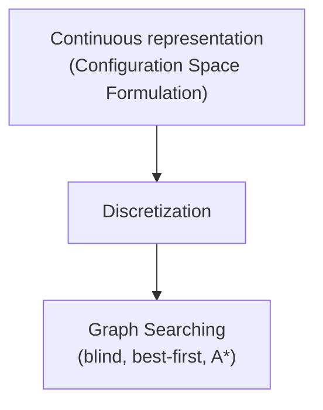

# ⚙️ Configuration Space

> A robot **configuration** is a specification of the positions of all robot points relative to a fixed coordinate system.

> Usually a configuration is expressed as a **“vector”** of position/orientation parameters
## ❓ Key Concepts

- It is **manifold** (variedad)
* Homotopic Paths
	* Two paths with the same endpoints are **homotopic** if one can be continuously deformed into the other.
* Information Spaces
	* La historia de todo lo que has visto y has hecho.

## 📍 Motion Planning Framework

## 🎯 Path Planning Approaches

* 1. Roadmap
	* Represent the connectivity of the free space by a network of 1-D curves
* 2. Cell decomposition
	* Decompose the free space into simple cells and represent the connectivity of the free space by the adjacency graph of these cells 
* 3. Potential field
	* Define a function over the free space that has a global minimum at the goal configuration and follow its steepest descent

## 🔗 Official & External Resources

*   **Official Docs Link Note:** `[[{{tool_name}} Documentation Links]]`
*   **Deep Dive:** [Article/Paper for advanced reading](https://example.com)

---
